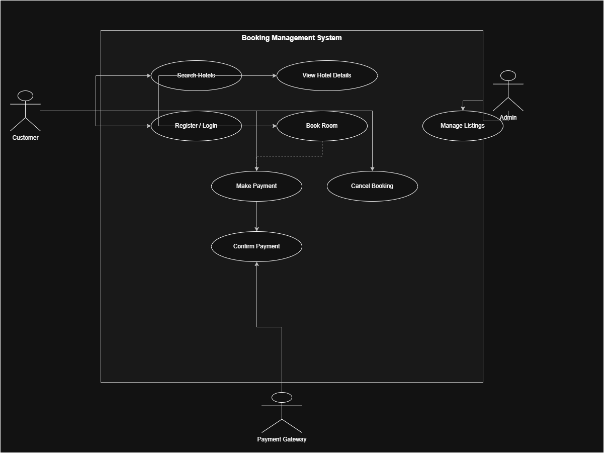

# Requirement Analysis in Software Development

## Introduction
This repository is dedicated to explaining the concept of Requirement Analysis in Software Development. It highlights the importance of gathering, analyzing, and documenting software requirements to ensure that projects meet user needs and function correctly. The purpose of this repository is to provide a clear understanding of how requirement analysis plays a critical role in the success of software projects.

---

## What is Requirement Analysis?

Requirement Analysis is the process of identifying, gathering, and documenting the needs and expectations of stakeholders for a software project. It is one of the most critical phases in the Software Development Lifecycle (SDLC) because it ensures that the final product aligns with the users' needs and business objectives.

During Requirement Analysis, software developers and business analysts work closely with stakeholders to understand the functional and non-functional requirements. Functional requirements describe what the system should do, while non-functional requirements define system qualities like performance, security, and usability.

### Importance of Requirement Analysis in SDLC:
- **Reduces Project Risks:** Proper analysis minimizes misunderstandings and reduces the likelihood of costly errors later in development.
- **Ensures Clear Communication:** Helps establish a common understanding between developers, clients, and other stakeholders.
- **Improves Quality:** Accurate requirements lead to a software product that meets user expectations and functions as intended.
- **Facilitates Project Planning:** Clear requirements allow better estimation of time, cost, and resources.
- **Supports Future Maintenance:** Well-documented requirements make it easier to update or expand the system in the future.

In short, Requirement Analysis lays the foundation for a successful software project by ensuring the development team builds the right product for the right users.

---

## Why is Requirement Analysis Important?

Requirement Analysis is a crucial step in the Software Development Lifecycle (SDLC) for several reasons:

1. **Reduces Errors and Misunderstandings**  
   By clearly defining what the software should do, requirement analysis minimizes the chances of miscommunication between stakeholders and developers, which helps prevent costly mistakes later in the project.

2. **Improves Project Planning and Management**  
   Understanding the requirements allows the team to estimate time, cost, and resources more accurately. It also helps in prioritizing tasks and setting realistic deadlines.

3. **Ensures Quality and User Satisfaction**  
   Well-analyzed requirements lead to software that meets user needs and expectations. This increases the likelihood of delivering a product that functions correctly, performs efficiently, and satisfies stakeholders.

4. **Facilitates Maintenance and Future Enhancements**  
   Documented requirements serve as a reference for future updates or expansions of the system, making maintenance easier and more efficient.

---

## Key Activities in Requirement Analysis

Requirement Analysis involves several key activities that ensure a clear understanding of what the software should achieve:

- **Requirement Gathering**  
  Collecting information from stakeholders, users, and other sources to understand the needs and expectations for the software project.

- **Requirement Elicitation**  
  Engaging with stakeholders through interviews, surveys, workshops, and observation to extract detailed and accurate requirements.

- **Requirement Documentation**  
  Organizing and recording the gathered requirements in a clear and structured manner, often using documents, diagrams, or use cases for future reference.

- **Requirement Analysis and Modeling**  
  Examining the documented requirements to identify inconsistencies, conflicts, or gaps. Creating models such as flowcharts, data models, or UML diagrams to visualize and clarify requirements.

- **Requirement Validation**  
  Reviewing the requirements with stakeholders to ensure they are complete, feasible, and aligned with business objectives, reducing the risk of misunderstandings and errors in later stages of development.

---

## Types of Requirements

### **Functional Requirements**
Functional requirements define the specific behaviors, features, and interactions that the system must support. For a hotel booking management system (based on the case study of hotel booking apps like Airbnb or OYO), these include:

- **Hotel Search and Discovery** – Users should be able to search for hotels based on location, check-in/check-out dates, and number of guests. The system should return a list of available hotels matching the search criteria.  
- **Room Booking** – Users can select a hotel and room type, specify the duration of stay, and proceed to book the room. The system should handle room availability checks and prevent double bookings.  
- **User Registration and Authentication** – Users must be able to create accounts, log in, and manage their profiles. The system should support secure authentication mechanisms.  
- **Payment Processing** – The system should integrate with payment gateways to process transactions securely, supporting various payment methods.  
- **Booking Management** – Users should be able to view, modify, or cancel their bookings. The system should update availability and notify users of any changes.  

### **Non-functional Requirements**
Non-functional requirements specify the quality attributes and constraints of the system. For the hotel booking management system, these include:

- **Performance** – The system should handle a high volume of concurrent users, with response times under 500 milliseconds for search queries and booking operations.  
- **Scalability** – The architecture should support horizontal scaling to accommodate increasing numbers of users and data.  
- **Availability** – The system should ensure high availability, with uptime of 99.9% or higher, to provide uninterrupted service to users.  
- **Security** – User data, including personal and payment information, should be encrypted and stored securely. The system should comply with relevant data protection regulations.  
- **Usability** – The user interface should be intuitive and accessible, providing a seamless experience across devices.

---

## Use Case Diagrams

### What are Use Case Diagrams?
Use Case Diagrams are a visual representation of how different users (called *actors*) interact with a system. They are part of the Unified Modeling Language (UML) and help describe the system’s functional behavior from a user’s point of view.  

Use Case Diagrams show the relationship between **actors** (such as customers, administrators, or external systems) and **use cases** (the various functions or services the system provides).

### Benefits of Use Case Diagrams
- **Clarifies System Functionality:** Helps identify what the system should do and who will use it.  
- **Improves Communication:** Provides a simple, visual way to explain system behavior to both technical and non-technical stakeholders.  
- **Aids in Requirement Analysis:** Ensures that all user interactions are captured and understood early in the development process.  
- **Supports Design and Testing:** Serves as a foundation for creating design specifications and test cases.

---

### Use Case Diagram for the Booking Management System

Below is the use case diagram representing the main interactions between users and the system.

**Actors:**
- **Customer** – Searches hotels, makes bookings, manages reservations, and makes payments.  
- **Admin** – Manages hotel listings, verifies availability, and updates pricing or details.  
- **Payment Gateway** – Processes and validates online transactions.  

**Main Use Cases:**
- Search Hotels  
- View Hotel Details  
- Register/Login  
- Book Room  
- Make Payment  
- Cancel Booking  
- Manage Listings (Admin)  
- Confirm Payment (Payment Gateway)  

---

## Acceptance Criteria

Acceptance Criteria define the specific conditions that a software feature must meet to be accepted by the stakeholders or end-users. They act as a checklist to verify that the functionality works as expected and fulfills the original requirements.

### Importance of Acceptance Criteria

- **Clarity and Alignment:** They ensure that developers, testers, and stakeholders share a common understanding of what “done” means for each feature.  
- **Improved Quality Assurance:** Acceptance criteria guide testing by providing measurable outcomes to confirm that the feature behaves correctly.  
- **Reduced Miscommunication:** Clearly defined acceptance criteria minimize misunderstandings and rework between teams.  
- **Traceability:** They link directly to user stories or requirements, ensuring that each goal is testable and achievable.

### Example: Checkout Feature in Booking Management System

**Feature:** Checkout Process  

**Acceptance Criteria:**
1. The system must allow users to review their booking details (dates, room type, and total price) before confirming payment.  
2. Users must be able to enter valid payment details (credit/debit card, mobile money, etc.).  
3. The system should display a confirmation message after successful payment.  
4. A confirmation email must be sent to the user’s registered email address.  
5. If payment fails, the user should receive an error message and be prompted to retry or choose another payment method.

